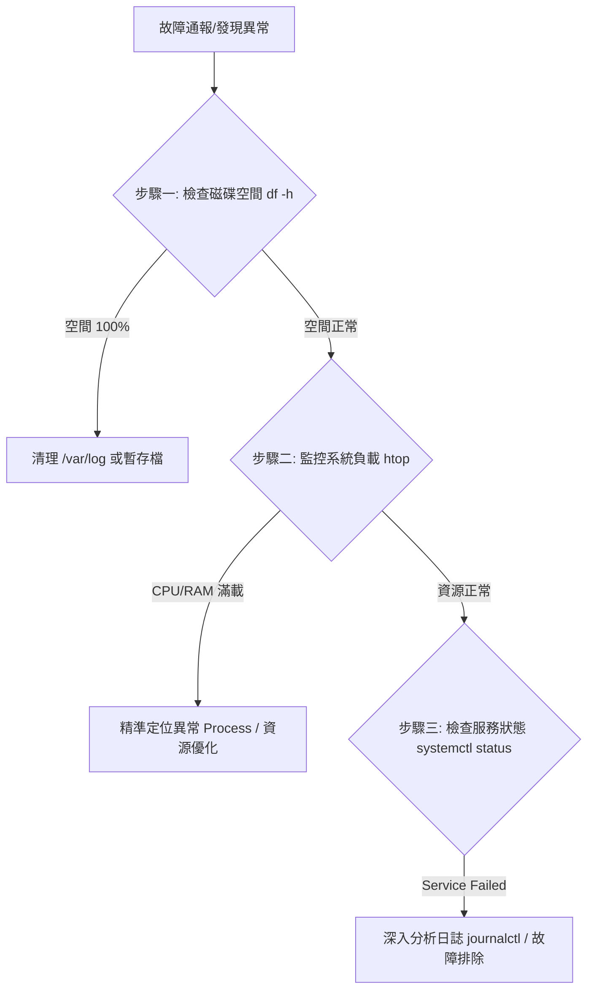

# 系統維運規格書：Linux 系統架構、硬體查核與故障排除指南
> **文件版本:** v1.0.0  
> **產出日期:** 2026-06-03  
> **機密等級:** 內部公開 (Internal Use Only)  
> **文件摘要:** 本文件旨在提供系統工程師、運維人員一 oxygen 化之標準作業程序（SOP），涵蓋環境識別、基礎硬體規格查核、Linux 系統目錄架構（FHS）解構，以及系統故障診斷之標準流程。

:::info 
---
markdown
System Architecture 
:::

:::warning
devsecops CI/CD/CT/CE 
:::
---

## 1. 環境識別與虛擬化判定 (Environment Detection)

在進行任何配置或維護前，必須先釐清目標主機之實體與虛擬化狀態，以利評估資源分配與硬體限制。

### 1.1 虛擬化狀態偵測
使用核心層級工具判斷當前環境為實體機（Bare-metal）或虛擬機（Virtual Machine）：

```bash
systemd-detect-virt

```

* **預期輸出結果說明：**
* `none`：代表該環境為 **實體伺服器 / 實體電腦**。
* `kvm` / `vmware` / `oracle` (VirtualBox) / `microsoft` (Hyper-V)：代表該環境為 **虛擬機 (VM)**。


### 1.2 硬體供應商識別

透過讀取 DMI (Desktop Management Interface) 資訊確認底層硬體或虛擬化平台之製造商：

```bash
sudo dmidecode -s system-manufacturer

```

* **實體機常見標籤：** `Dell Inc.`, `HP`, `ASUS`, `Supermicro`。
* **虛擬機常見標籤：** `QEMU`, `VMware, Inc.`, `Microsoft Corporation`。

---

## 2. 硬體設備規格查詢規格 (Hardware Specification Audit)

本章節規範如何提取系統中各核心物理/虛擬硬體元件之靜態與動態規格。

### 2.1 運算單元 (CPU)

* **主體規格總覽：**
```bash
lscpu

```


*(用以查核 CPU 架構、實體核心數、超執行緒、時脈與快取大小)*
* **核心詳細資訊：** `cat /proc/cpuinfo`

### 2.2 記憶體單元 (RAM)

* **即時容量與可用性：**
```bash
free -h

```


*(其中 `-h` 參數轉換為人類易讀格式，用以確認當前 Free 與 Available 數量)*
* **硬體插槽規格查核：**
```bash
sudo dmidecode -t memory

```


*(用以查核記憶體實體型態如 DDR4/DDR5、工作頻率、插槽數量與單條容量)*

### 2.3 儲存設備單元 (Storage: SSD / HDD)

* **儲存裝置樹狀拓樸：** `lsblk`
* **儲存媒體型態（SSD/HDD）與型號識別：**
```bash
lsblk -o NAME,MODEL,ROTA,SIZE,TYPE

```


* **關鍵欄位 `ROTA` (Rotational) 判定標準：**
* `0` $\rightarrow$ **SSD (固態硬碟)**，無機械旋轉結構。
* `1` $\rightarrow$ **HDD (傳統機械硬碟)**，具備旋轉磁頭結構。


* **實體硬碟詳細清單：** `sudo lshw -class disk`

### 2.4 圖形處理單元 (GPU)

* **NVIDIA 專用架構：**
```bash
nvidia-smi

```


*(用以查核 GPU 型號、CUDA 驅動版本、核心溫度、顯存 VRAM 使用率與運行行程)*
* **通用 PCI 顯示卡查核：** `lspci | grep -i vga`

### 2.5 主機板與韌體 (Motherboard & BIOS)

* **主機板型號與序號：** `sudo dmidecode -t system`
* **BIOS / 韌體版號：** `sudo dmidecode -t bios` *(確認韌體版本與發布日期以利安全性更新漏洞評估)*

### 2.6 綜合規格快速查核

* **硬體簡表：** `sudo lshw -short`
* **全規格儀表板：** `inxi -F` *(需透過套件管理器預先安裝)*

---

## 3. Linux 系統目錄架構規範 (Filesystem Hierarchy Standard)

Linux 檔案系統遵循 FHS 規範，所有目錄皆由根目錄 `/` 延伸。理解目錄職責是實施精準排錯的先決條件。

| 目錄路徑 | 職責定義 (Responsibility) | 排錯與維運應用 (Troubleshooting Use Case) |
| --- | --- | --- |
| **`/etc`** | **系統與服務配置心臟** | 存放所有應用程式、網路、核心模組之設定檔（如 `nginx.conf`），排查配置錯誤時必訪。 |
| **`/var`** | 內部動態資料（Variable） | 存放常態性、頻繁變動之資料。 |
| **`/var/log`** | **系統日誌聚集地** | **排錯第一現場**。存放核心日誌、系統服務日誌、認證日誌。 |
| **`/bin`** | 基礎使用者執行檔 | 存放系統最基礎且不分權限皆可使用的核心指令（如 `ls`, `cp`, `bash`）。 |
| **`/sbin`** | 系統管理員執行檔 | 存放僅供超級管理員（Root）或具備 sudo 權限者使用之管理指令（如 `fdisk`, `reboot`）。 |
| **`/proc`** | 虛擬核心資訊（Process） | 核心於記憶體中之映射，反映即時系統狀態與進程資訊（如 `/proc/meminfo`），不佔硬碟空間。 |
| **`/dev`** | 硬體裝置抽象檔案（Device） | Linux 「一切皆檔案」原則。硬體設備在此被抽象為檔案（如第一顆硬碟為 `/dev/sda`）。 |
| **`/home`** | 一般使用者家目錄 | 各使用者的個人空間（如 `/home/user1`），包含個人環境變數設定。 |
| **`/root`** | 超級管理員家目錄 | Root 專屬家目錄，獨立於 `/home` 之外以保障系統安全。 |
| **`/tmp`** | 系統暫存區 | 存放臨時建立的檔案，多數系統在重開機時會強制清空此目錄。 |

---

## 4. 系統監控與故障排除標準作業程序 (Troubleshooting SOP)

當系統發生「效能瓶頸」、「服務中斷」或「硬體異常」時，應依循下列結構化步驟進行根因分析（Root Cause Analysis, RCA）。



### 4.1 步驟一：磁碟空間查核

空間耗盡（100%）是造成 Linux 服務崩潰（尤其是資料庫）最常見的主因。

* **查核指令：**
```bash
df -h

```


* **應變措施：** 若發現特定掛載點（如 `/` 或 `/var`）已滿，使用以下指令找出高佔用之目錄：
```bash
sudo du -sh /var/log/*

```


### 4.2 步驟二：系統負載與進程動態分析

* **高可視化監控：**
```bash
htop

```


*(即時監控 CPU 核心負載、記憶體占用比率、Swap 觸發狀態以及特定進程 PID 耗時)*
* **靜態記憶體快速盤點：** `free -h`

### 4.3 步驟三：服務狀態診斷與日誌追蹤

當特定軟體（如 Nginx, MySQL）無故中斷時，應提取 Systemd 的日誌遺言。

* **檢查服務現況：**
```bash
sudo systemctl status [服務名稱]

```


* **提取該服務最新之錯誤日誌（定位至結尾）：**
```bash
sudo journalctl -u [服務名稱] -e

```


* **全局錯誤追蹤（系統最後發生的崩潰點）：**
```bash
sudo journalctl -xe

```


* **核心級錯誤（硬體、網卡、驅動層級）：**
```bash
sudo dmesg -T | tail -n 50

```


### 4.4 步驟四：儲存裝置健康度檢測 (S.M.A.R.T.)

懷疑硬碟損壞、壞軌或 SSD 壽命用盡時之檢測手段（需安裝 `smartmontools`）：

* **簡易健康狀態核對：**
```bash
sudo smartctl -H /dev/sda

```


*(輸出結果若顯示 `PASSED` 代表基本狀態正常；若為 `FAILED` 應立即實施資料遷移)*
* **完整規格與詳細壽命分析：** `sudo smartctl -a /dev/sda`

---

## 5. 附錄：工程師黃金排錯檢索表

| 故障現象 | 優先執行指令 | 關聯核心目錄 |
| --- | --- | --- |
| 服務無法啟動、寫入失敗 | `df -h` | `/var/log`, `/tmp` |
| 系統極度卡頓、反應遲緩 | `htop`, `free -h` | `/proc` |
| 外部請求無法連入、網路異常 | `ip addr`, `netstat -tulnp` | `/etc/netplan`, `/etc/resolv.conf` |
| 修改設定後服務崩潰 | `journalctl -xe` | `/etc/[服務名稱]/` |
| 硬碟讀取緩慢、發生 I/O Error | `sudo dmesg -T | tail` | `/dev` |

